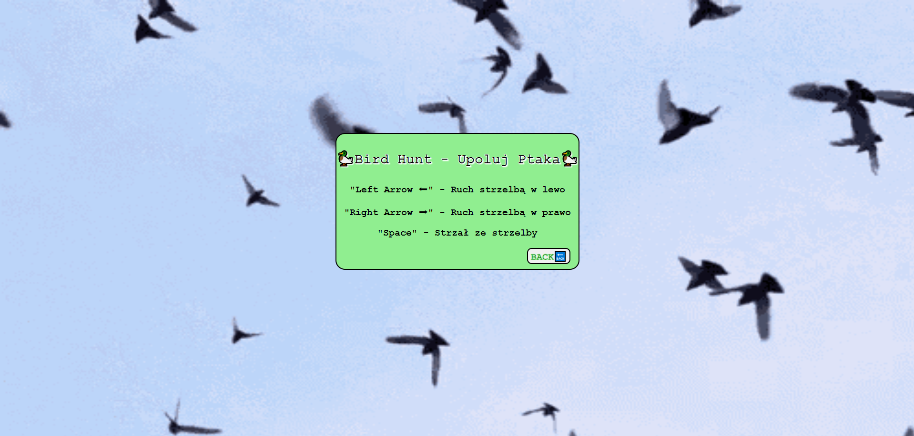
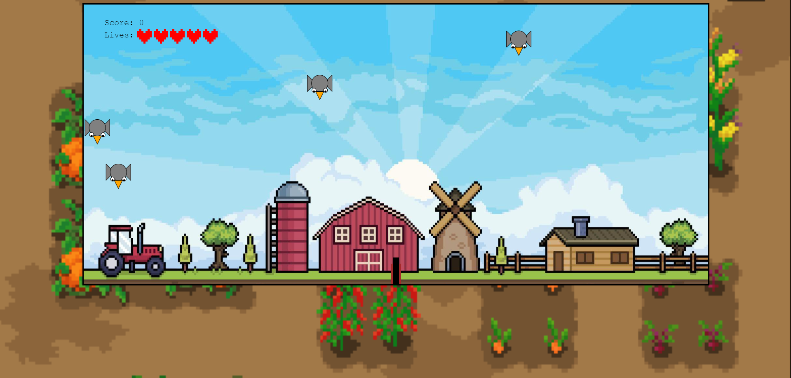
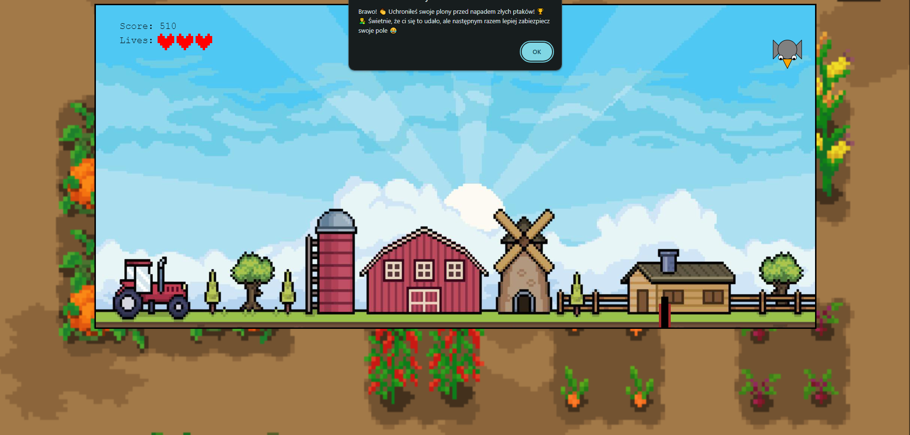
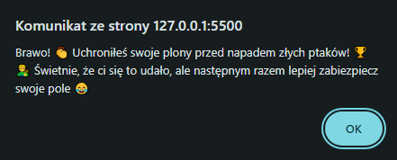
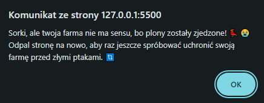
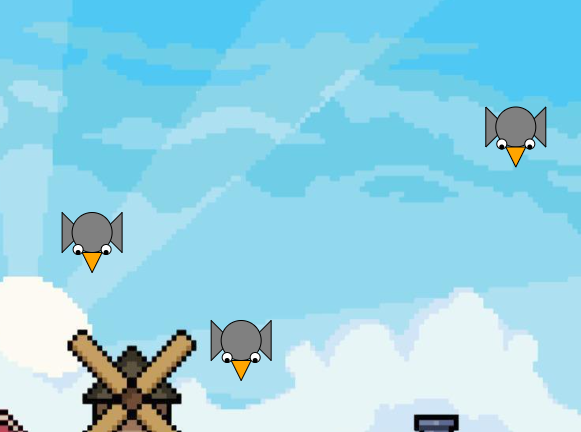

# 🦆Bird Hunt - Upoluj Ptaka🦆

Czy pamiętasz może takie gry na automatach albo na starych konsolach z cartridge'ami, gdzie brało się plastkiwoy pistolet i strzelało się do kaczek lub innych ptaków? Jeżeli tak to znowu będziesz miał okazję to zrobić (tylko niestety już bez pistoletu 😅) w mojej grze "Bird Hunt - Upoluj Ptaka!" 🐦. Gra jest bardzo prosta i nie ma większej fabuły - po prostu łapiesz za giwerę i strzelasz do nadlatujących ptaków, które próbują zniszczyć twoją farmę, a dokładniej twoje plony! 👨‍🌾 Twoim celem jest właśnie ocalenie twojej farmy przed stadem złych i głodnych ptaków, ale uwaga - masz tylko 5 żyć i jeżeli ci się one skończą, to niestety będziesz musiał zasiać pole raz jeszcze 💔🌾😭 Musisz też uważać na to, że gdy zabijesz już 25 ptaków, to reszta stada jest jeszcze agresywniejsza i zaczynają przyspieszać, a jak zabijesz aż 40 ptaków, to reszta całkowicie jest rozwścieczona i zaczyna napastować twoją farmę szturmem!!!😠😡🦅 Jeżeli natomiast uda ci się zdobyć upolować 50 ptaków (każdy ptak to 10 puntków), to możesz pójść spać spokojnie, bo twoja farma oraz plony będą bezpieczne! 😁🏆🌾

## Przykładowe zrzuty ekranu z gry📷

## Instrukcja Obsługi📖

Jak Odpalić grę?

- Pobrać wszystkie pliki z repozytorium mojej gry
- Wrzucić wszystkie do jednego folderu o dowolnej nazwie i w dowolnej lokalizacji (tylko absolutnie wszystkie pliki z mojego repozytorium muszą się tam znaleźć, inaczej coś może nie zadziałać!!!)
- Odpalić plik "index_gierka.html" i cieszyć się rozgrywką!!!

Sterowanie

- "Strzałka w lewo" - ruch strzelbą w lewą stronę
- "Strzałka w prawo" - ruch strzelbą w prawą stronę
- "Spacja" - wystrzał z strzelby

## Źródło grafik i dźwięków do gry🏡🎶
- ZDJĘCIA: Google grafika - grafiki z nazwami "pixel birds", "pixel farm", "flying birds", "farm plants" itd.
- DŹWIĘKI: Youtube

